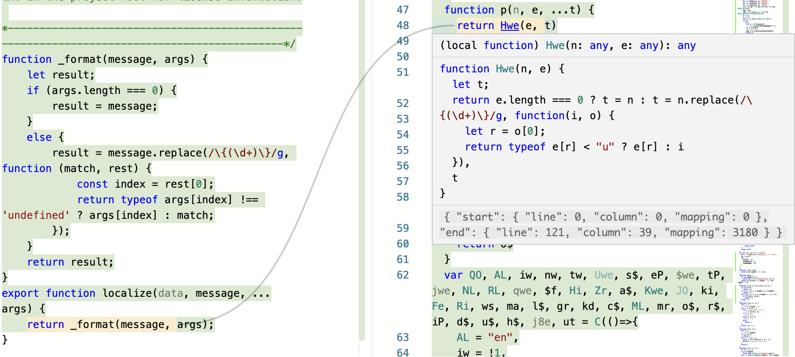

# code-tools



## Local development

```
pnpm i
pnpm run build -w
node packages/coverage-viz/build-monaco.mjs
node packages/coverage-viz/build.mjs serve
```

http://localhost:8000/app.html

http://localhost:8000/examples/
